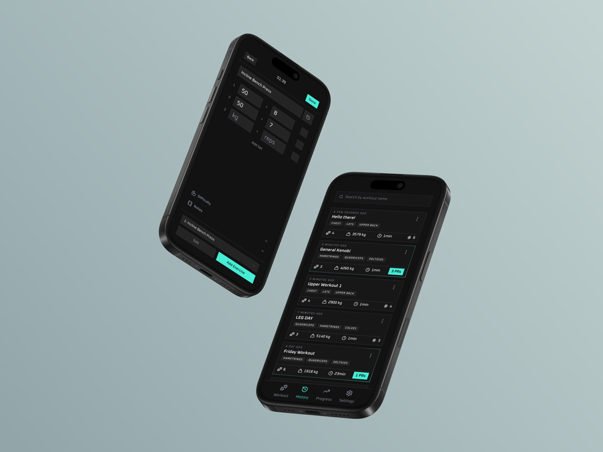
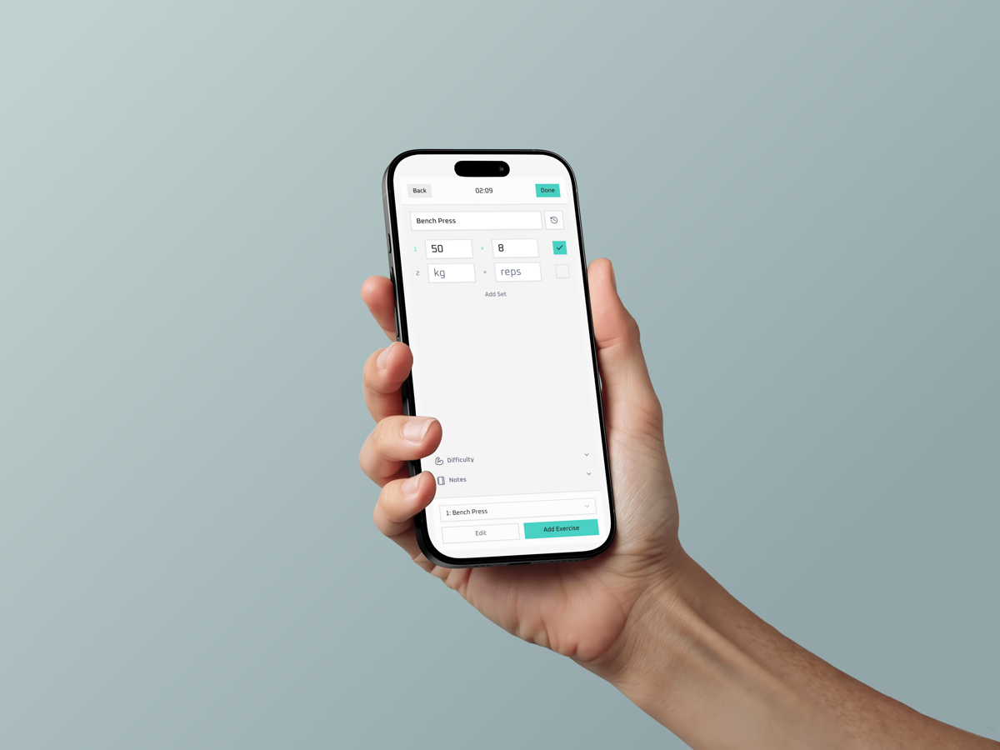

# Horus

> Project WIP

A web app to track my gym workouts. I created my own because I don't enjoy
existing solutions and my current method of tracking workouts (excel sheet) is
inefficient and doesn't scale well.

**[Link](horus-workout.vercel.app)**

    
    

## Features

- Create, edit, delete, and save workouts
- Log exercises, sets, reps, and weights
- Store workouts between sessions
- Secure sign up and login
- Personal accounts with each user’s data kept separate
- Track workout history over time
- Track stats like total workout volume and personal records
- Built-in form validation to reduce mistakes
- Clear error messages and feedback when something goes wrong
- Mobile-friendly, responsive design
- Multiple theme options with 3 visual variants
- Clean, easy-to-use interface

---

## Built using:

- Next.js 16
- React 19
- TypeScript
- Convex
- Better Auth
- Redis
- Zod
- React Hook Form
- Tailwindcss
- shadcn/ui

## Why Next.js?

I used Next.js simply because I wanted to learn it. I wanted to learn how to
build a full-stack app and focus on new things like authentication or
working with a database, while using familiar tools like React and TypeScript
as a foundation. I also chose a web app because its faster and easier to
prototype and get running compared to using something like Flutter or Kotlin.
In the future, I plan to build a native mobile version of this app.

> This is a for-fun learning project. As a result, this is not a vibe-coded app.
I'm using AI as a teacher, and not as a tool to generate code for me, because
learning how to actually build things myself matters to me. I want to
understand how everything works. Also I'm trying not to become useless and
obsolete.

---

## TODO:

### General

- [x] redesign nav bar component
- [x] reorganise file structure
- [x] add modals
    - [x] submitting workout
    - [x] deleting
- [x] add toast notifications
- [x] fix destructive colour, not bright enough
- [x] adjust primary colour for light mode
- [ ] add suspense/loading states
    - [x] workout list
    - [x] edit forms
    - [x] user
- [x] make a proper dark mode, and have 3 app styles/themes (glass effect looks like slop unfortunately)
    - [x] fix exercise name input having a margin/padding
    - [x] fix borders not showing on dark mode
    - [x] fix colours looking off for bg and grey
    - [x] fix glass theme bg on UserButton component
- [x] fix grey colours on light mode for inputs and secondary buttons, so it doesn't look disabled
    - [ ] still need to fix inputs on light mode
- [x] implement convex as backend
    - [x] remove unused prisma and sqlite code
- [x] implement auth (clerk)
    - [x] connect to convex
    - [x] add chevron to indicate profile bar is clickable without affecting trigger
    - [x] fix div min height on profile bar
- [x] betterauth
    - [x] implement otp
    - [x] fix otp code ui
    - [x] use resend to send emails
    - [x] format email content
    - [x] use jwt cache
    - [x] fix signout route
    - [x] setup rate limiter
    - [x] setup oauth
    - [x] add user  avatar
    - [x] make account page
    - [x] fix sign out on dashboard doesn't refresh the name
    - [x] increase time for session expiry
    - [ ] setup emails notifications for delete account, email change, etc
- convex
    - [ ] use action cache component
    - [ ] use rate limiter
    - [ ] add max/upper character limits to inputs

### Create Workout Page

- [x] fix stopwatch not resuming progress
- [x] implement react hook form instead of state
    - [x] fix validation with RHF
        - [x] fix reps validation error not dissappearing until submit
    - [x] fix not loading previous data in edit mode
        - [x] fix exercises loading in reverse order
    - [x] fix autoscroll behaviour not working
        - need to get the id since it doesnt exist yet, cant use same var
        - [x] fix not smooth scrolling
    - [x] implement deleting sets/exercises
        - [x] add toggle for edit mode
        - [x] need to make buttons look like actual buttons, recent look like a heading
        - [x] make the add exercise button toggle to delete exercise in edit mode
        - [x] checkbox state needs to persist between changing edit mode
        - [ ] deleting a set during edit and re-adding it makes it show up again
        - [x] deleting a set removed everything after it, not just that set
        - [ ] implement undo delete
- [x] print validation errors in the ui
    - [x] fix no sets error doesn't go away when adding set
- [x] suggestions for exercises
    - [x] get exercises from an api
    - [x] show results that are actually similar/matching to the input
    - [x] fix exercises names not loading for edit
    - [x] fix choosing exercise from the list makes the set inputs nan
    - [x] make function to turn exercises from api into title case
    - [ ] cache api results to prevent repeat api requests
        - [ ] @convex-dev/action-cache
        - [ ] clear suggestions (global exercises that have no instances, from that user)
            - need to make globals exercises linked to the user
    - [x] make a search button instead of auto calling the api
    - [x] add default exercises (common ones)
    - [x] show loading state for fetching exercises from db and api
    - [x] show error for too many requests as a toast
    - [x] fix Error fetching from API: TypeError: groupTwo is not iterable
    - [x] extract the toast messages into a toastMessages.ts
    - [ ] redo error handling
-  [x] make exercise form appear after typing the name
    -  [x] fix exercise bottom bar not showing when loading a workout with a single exercise
- [x] always add empty set or exercise if last one is deleted
- [x] remove workout title input, only prompt workout title on submit
- [ ] implement preset feature
    - [ ] add option to save an existing workout as a preset
    - [ ] add ability to keep rep and weights or use blank
- [ ] implement saving incomplete workout draft
- [ ] implement supersetting feature
- [x] add exercise indicator to show how many exercises in the workout
    - [x] tap to select exercises from a list, to scroll to that one
- [ ] history icon -> opens dialog to show last 5 sets of that exercise
- [x] fix dropdown not matching width of input
- [x] implement another way to delete exercise without inputting the name
- [ ] filter out empty sets and exercises rather than invalidating the workout
- [ ] clear input button on exercise name
- [x] fix duration timer to increment using real time
- [x] redesign the ui and remove the redundant add set button
    - [x] move position of edit and recent buttons
    - [x] change add exercise button to use text because its unclear
- [ ] FIX: workouts always save as friday workout

### History

- [x] load save workouts from db
- [x] edit workouts using the same form
- [ ] make seperate workout view page for past workouts
- [x] fix card when no prs
- [x] implement muscle groups to display on the workout card
    - [x] workouts need to save muscle groups info
    - [x] update prisma schema to include muscleGroups
    - [x] load muscle group for each exercise
    - [ ] keep space consistent when no muscle group badges are present
- [x] calculate prs
    - Weighted exercises
        -Heaviest weight: weight
        - Highest set volume: weight * reps
    - Bodyweight exercises
        - Highest reps: reps
    - [x] dont make it a pr if its the first set
- [x] calculate prs on submission instead of history fetch, to allow for pagination and faster loading
- [x] calculate total volume lifted
- [x] calculate total exercises in workout
 - [ ] add search bar
    - [ ] make it expand from button
    - [ ] or opens modal?
    - [ ] search workouts by title or muscle group or exercise. use a dropdown to select type
- [ ] filter workouts, by:
    - [ ] date ranges
    - [ ] workout type/presets
    - [ ] workouts containing specific exercise/muscle group
- [x] add pagination
- [ ] fix cant tab through each card

### Progress

- [ ] graphs to show progression over time
    - [ ] chart.js?
- [ ] [filter stats](workout-tracker.md#stats-to-calculate)
- [ ] frequency heatmap to show sessions per time period
- [ ] weekly summary

### Dashboard

- [x] change to start workout instead of create (more clear)
- [ ] show goals/stats on dashboard for motivation
    - [ ] show frequency heatmap of sessions
    - [ ] prs
