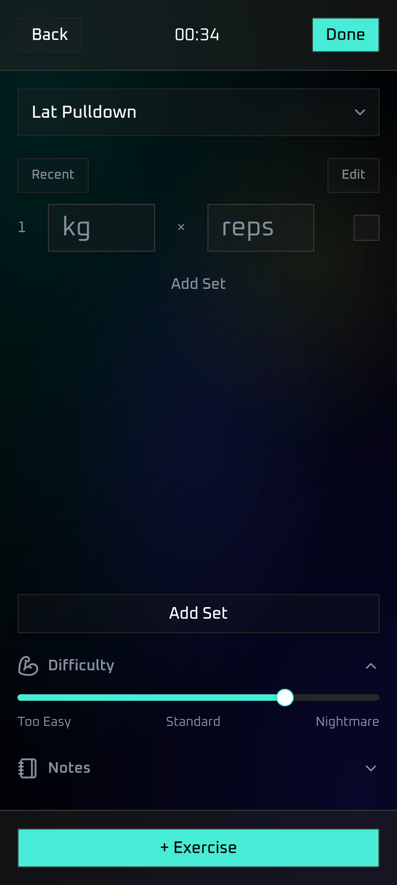

# Horus

> Project WIP

A web app to track my gym workouts. Created my own because I don't enjoy
existing solutions and my current method of tracking workouts (excel sheet) is
inefficient and doesn't scale well.

---

This is a learning project. I write the code myself to understand it and enjoy
the process. I'm using AI as a teacher to help me learn, not as a tool to
generate code for me, because learning how to actually build things matters
more to me than having solutions handed to me. Also I'm trying not to become
obsolete.

## Built using:

- Next.js 16
- React
- Typescript
- Tailwindcss
- shadcn/ui
- SQLite
- Prisma
- Zod
- React Hook Form

## Why Next.js?

I used Next.js simply because I wanted to learn it. I wanted to learn how to
build a full-stack app and focus on learning new things like working with a
database and building forms with validation, while using familiar tools like
React and TypeScript as a foundation. I also chose a web app because its faster
and easier to prototype and get running compared to using something like
Flutter or Swift. In the future, I plan to build a native mobile version of
this app.

## TODO:

### Create Workout Page

- [x] fix stopwatch not resuming progress
- [x] implement react hook form instead of state
    - [x] fix validation with RHF
        - [x] fix reps validation error not dissappearing until submit
    - [x] fix not loading previous data in edit mode
        - [x] fix exercises loading in reverse order
    - [x] fix autoscroll behaviour not working
        - need to get the id since it doesnt exist yet, cant use same var
        - [x] fix not smooth scrolling
    - [x] implement deleting sets/exercises
        - [x] add toggle for edit mode
        - [x] need to make buttons look like actual buttons, recent look like a heading
        - [x] make the add exercise button toggle to delete exercise in edit mode
        - [x] checkbox state needs to persist between changing edit mode
        - [x] deleting a set during edit and re-adding it makes it show up again
        - [ ] implement undo delete
- [x] print validation errors in the ui
    - [x] fix no sets error doesn't go away when adding set
- [ ] suggestions for exercises
    - [x] get exercises from an api
    - [x] show results that are actually similar/matching to the input
    - [x] fix exercises names not loading for edit
    - [x] fix choosing exercise from the list makes the set inputs nan
    - [ ] make function to turn exercises from api into title case
    - [ ] cache api results to prevent repeat api requests
    - [x] make a search button instead of auto calling the api
    - [ ] add custom exercises, with prompt on whether to create it
       (check if its from the suggestions array, and if its in db)
    - [ ] add exercise source in db
-  [x] make exercise form appear after typing the name
- [x] always add empty set or exercise if last one is deleted
- [x] remove workout title input, only prompt workout title on submit
- [ ] implement preset feature
    - [ ] add option to save an existing workout as a preset
    - [ ] add ability to keep rep and weights or use blank
- [ ] implement saving incomplete workout draft
- [ ] implement supersetting feature
- [ ] add exercise indicator to show how many exercises in the workout
    - [ ] tap to select exercises from a list, to scroll to that one
- [ ] history icon -> opens dialog to show last 5 sets of that exercise
- [x] add modals
    - [ ] creating workout/loading draft
    - [x] submitting workout
    - [x] deleting
- [x] add toast notifications

### History

- [x] load save workouts from db
- [x] edit workouts using the same form
- [ ] make seperate workout view page for past workouts
- [ ] calculate prs
- [ ] filter workouts, by:
    - [ ] date ranges
    - [ ] workout type/presets
    - [ ] workouts containing specific exercise/muscle group

### Progress

- [ ] graphs to show progression over time
    - [ ] chart.js?
- [ ] [filter stats](workout-tracker.md#stats-to-calculate)
- [ ] frequency heatmap to show sessions per time period
- [ ] weekly summary

### Dashboard

- [ ] show goals/stats on dashboard for motivation
